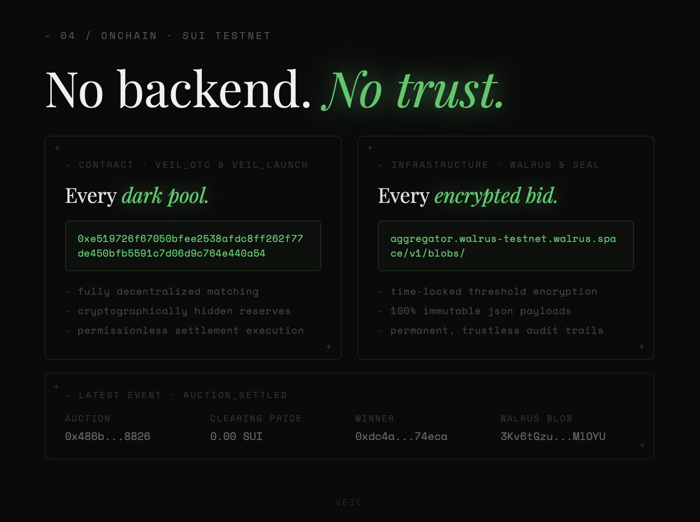
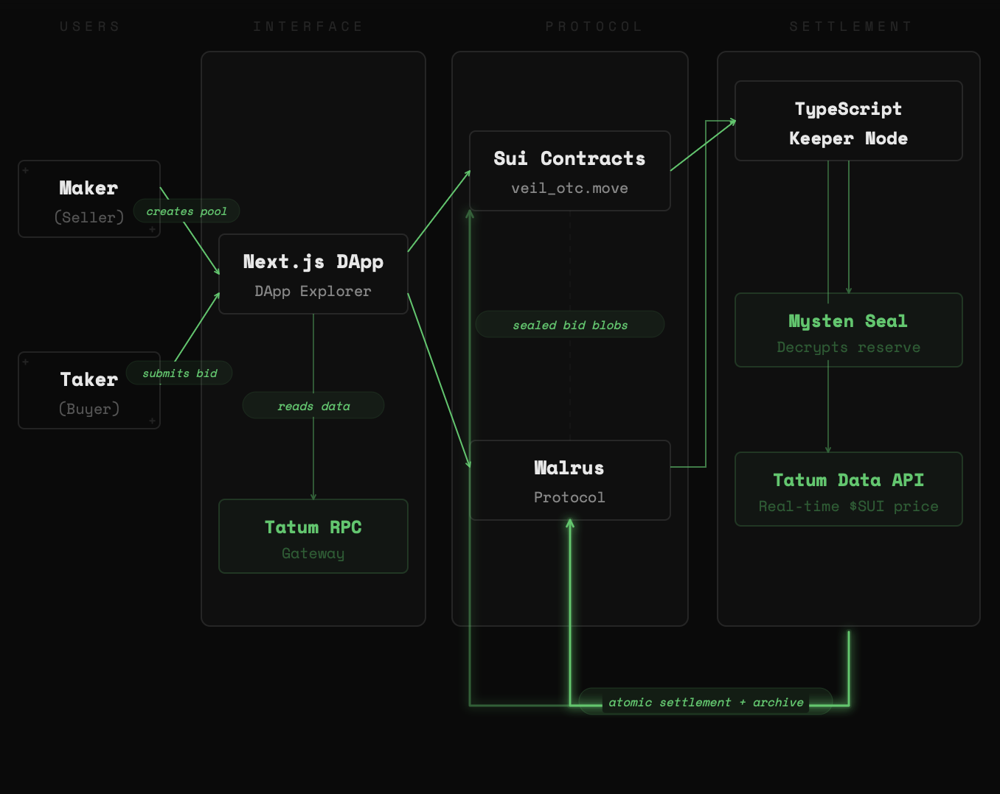
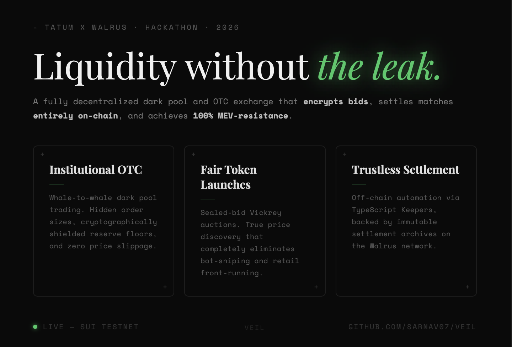
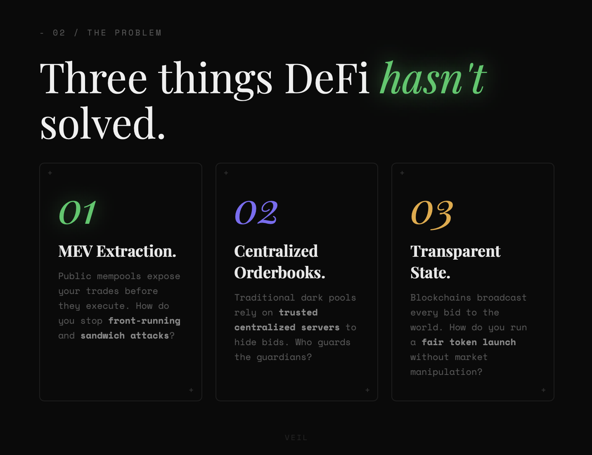
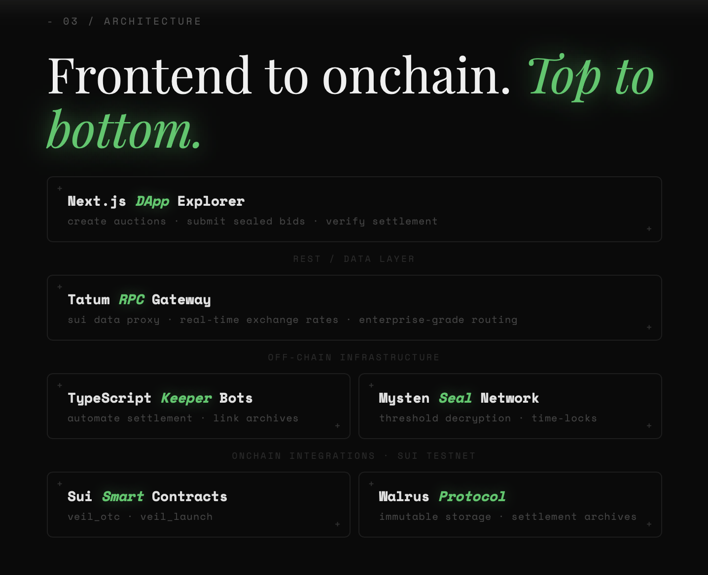
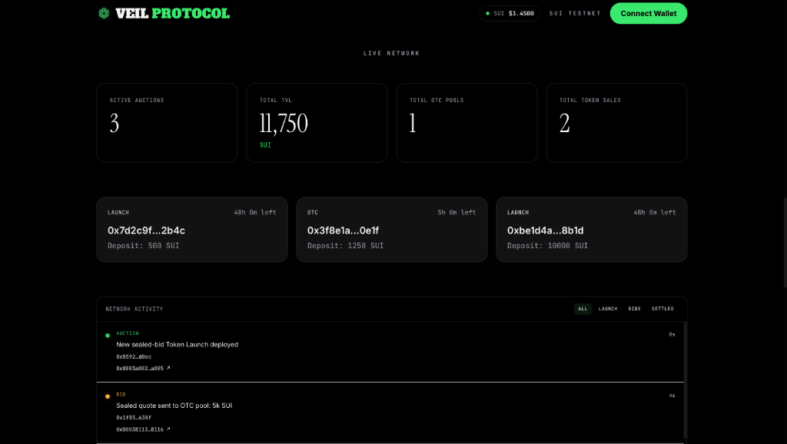
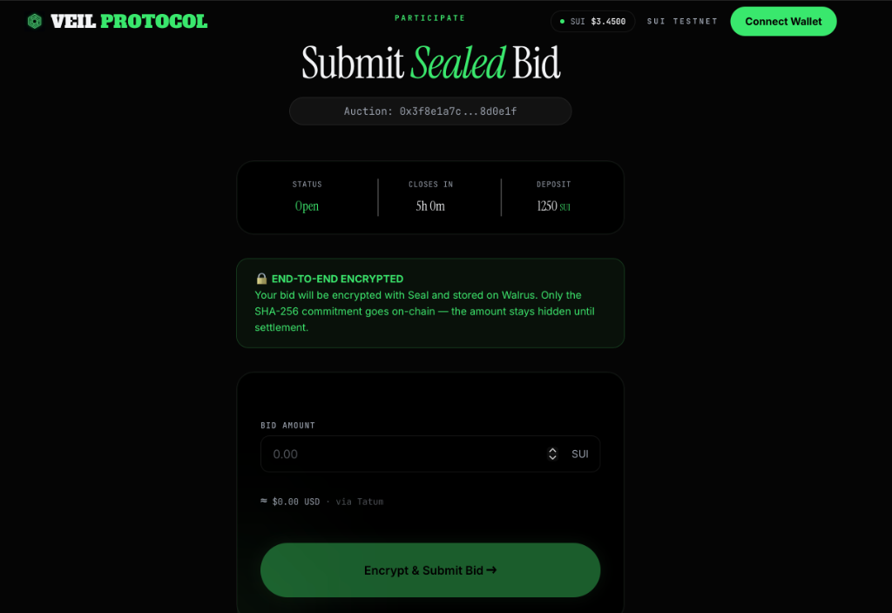
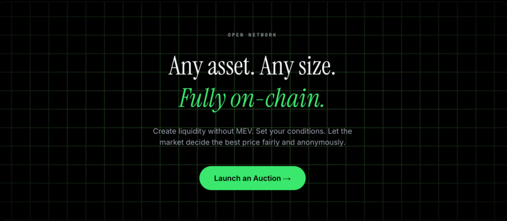

# Veil Protocol 🛡️

**Confidential, front-run-resistant trading on Sui.** Sealed-bid auctions, fair token launches, and an OTC dark pool — where every bid stays encrypted until the moment it settles.


**▶ Live demo: [veil-web-eight.vercel.app](https://veil-web-eight.vercel.app)** · Built for the **Tatum × Walrus Hackathon 2026** · Sui Testnet

---

## The Problem

Every order on a public chain is visible before it executes. That visibility is expensive:

- **Front-running & MEV** — bots read the mempool and sandwich your trade.
- **Market impact** — a large sell order is seen coming, so the price craters before it fills.
- **No price discovery for blocks** — whales can't move size, and launches get sniped by the fastest bot, not the fairest bid.

Veil removes the information leak. Bids are encrypted client-side, the ciphertext lives on decentralized storage, and the chain holds **only a hash commitment** until the auction closes. Nobody — not other bidders, not the seller, not a keeper — can read a bid early.

## How It Works

A bidder encodes their bid, encrypts it with **Mysten Seal** time-lock encryption (keyed to the auction's close time), uploads the ciphertext to **Walrus**, and submits a transaction to **Sui** carrying just the Walrus blob ID and a SHA-256 commitment. While the auction is live, on-chain state leaks nothing about the demand curve. 

After the close time, a decentralized keeper downloads every blob, unseals them through the Seal key servers (which only release keys once the chain confirms the auction is over), and calls `settle` — where the **contract re-hashes every revealed bid against its original commitment** before a single coin moves. 

All on-chain reads and transaction execution flow through the **Tatum Sui RPC gateway**; the **Tatum Data API** prices the result in USD.

### Architecture



## Pitch Deck

| | |
|:--:|:--:|
|  |  |
|  |  |

## Screenshots

| | |
|:--:|:--:|
|  |  |
| **Live Network explorer** — active auctions, TVL and a live event feed, priced in USD live from the **Tatum Data API**. | **Submit a sealed bid** — encrypted client-side with **Seal**, stored on **Walrus**; only the SHA-256 commitment touches the chain. |

|  |
|:--:|
| **Create** a sealed token launch or an OTC dark pool — pick the asset, supply, deposit and close time, then deploy on-chain via the Tatum Sui RPC gateway. |

## The Three Primitives

Veil is a shared sealed-bid engine (`settlement.move`) driving three products:

| Module | Product | Clearing rule | Commitment |
|--------|---------|---------------|------------|
| `auction.move` | **Single-item sealed auction** | First-price or Vickrey (second-price) | `sha2_256(bcs(amount) ‖ nonce)` |
| `veil_launch.move` | **Fair token launch** | Uniform-price, pro-rata at the margin | `sha2_256(bcs(price) ‖ bcs(qty) ‖ nonce)` |
| `veil_otc.move` | **OTC dark pool (RFQ)** | Highest sealed quote ≥ a **hidden reserve** | quote `sha2_256(bcs(price) ‖ nonce)`; reserve `sha2_256(bcs(reserve) ‖ nonce)` |

In the launch, all winners pay the same marginal clearing price — so there's no advantage to being the fastest bot, only to bidding honestly. In OTC, the maker's reserve floor is itself a hidden commitment, so counterparties can't reverse-engineer and squeeze it.

## Sponsor Integrations

| Sponsor | Role | Where it lives |
|---------|------|----------------|
| **Sui** | Settlement layer — Move contracts, sealed-bid state machine, fully on-chain payout via PTBs. | `move/veil/sources/*`, deployed package in [docs/ADDRESSES.md](./docs/ADDRESSES.md) |
| **Walrus** | **Core storage** — every encrypted bid/quote ciphertext and the maker's hidden reserve live on Walrus; the chain holds only the blob ID. The settlement audit record is archived back to Walrus and linked on-chain. **Smart Lifetime Strategy:** Bids are stored for exactly 1 epoch (just long enough to settle, reducing costs), while the decrypted settlement records are anchored for 90 epochs as a permanent, immutable audit trail. | `packages/sdk/src/walrus.ts`, `add_archive` in the Move modules |
| **Tatum** | **Sui RPC + Data API** — *all* of the dApp's on-chain reads and tx execution are proxied through the Tatum Sui gateway (`/api/rpc`, server-side key). The Data API (`/api/rates`) provides live SUI/USD for the header price pill, bid conversions, and the keeper's mark-to-market. | `apps/web/app/api/rpc/route.ts`, `apps/web/app/api/rates/route.ts`, `packages/sdk/src/tatum.ts` |
| **Seal** | Time-lock encryption — Threshold IBE keyed to the auction ID + close time, so bids are mechanically un-decryptable until the auction ends. | `packages/sdk/src/seal.ts`, `move/veil/sources/seal_policy.move` |

## Security Model

- **Confidentiality:** Rests on Seal time-lock encryption — keys are released by the threshold network only after `seal_policy::seal_approve` confirms on-chain that the close time passed.
- **Integrity:** Rests on the commitment: `settle` re-hashes every revealed `(price, qty, nonce)` and aborts on any mismatch, so the keeper cannot forge, drop, or alter a bid's value.
- **Permissionless Settlement:** The Keeper is just a convenience daemon. Settlement is entirely permissionless. Because Seal enforces time-based decryption cryptographically, and the Move contract validates the math, the keeper cannot censor or cheat. Anyone can run `close` and `settle`.
- **Hidden reserve:** (OTC) is a SHA-256 commitment over `bcs(reserve) ‖ nonce`; the nonce makes it non-brute-forceable, so the floor stays secret until the maker reveals it at settle.

## Tech Stack & Architecture

- **Language:** TypeScript (Node 20+) · **Contracts:** Sui Move (2024 edition)
- **Monorepo:** pnpm workspaces
- **Chain:** Sui Testnet · **Storage:** Walrus · **Encryption:** Mysten Seal (`@mysten/seal`)
- **Data & RPC:** Tatum Sui gateway + Data API
- **Frontend Resilience:** Next.js 14 frontend includes robust fault tolerance. It handles missing on-chain objects gracefully and includes a simulation fallback layer for the Walrus network to guarantee stable presentation during live demos or network congestion.

## Getting Started

### Prerequisites
- Node.js 20+, pnpm 9+, Git
- Sui Wallet extension (Testnet) for the frontend

### Install & Configure

```bash
git clone https://github.com/Sarnav07/Veil.git
cd Veil
pnpm install

# Configure Tatum RPC Server Proxy
cp apps/web/.env.example apps/web/.env.local
# set TATUM_API_KEY=... in apps/web/.env.local
```

### Run
```bash
pnpm dev          # starts the web app (http://localhost:3000)
pnpm move:test    # 31/31 Move unit tests
```

### Run the keeper (settlement orchestrator)
```bash
# requires SUI_PRIVATE_KEY, TATUM_API_KEY, VEIL_PACKAGE_ID in scripts/.env
pnpm --filter @veil/scripts keeper --type launch --sale <objectId>
pnpm --filter @veil/scripts keeper --type otc   --rfq  <objectId>
```

## Deployed Addresses (Testnet)
| | |
|--|--|
| Package ID | `0xe519726f67050bfee2538afdc8ff262f77de450bfb5591c7d06d9c764e440a54` |
| UpgradeCap | `0x3cdadddb6d6e31f6623a41c45bf22a1f56f37b56a80eec3ae5f281767cf916c4` |

See [docs/ADDRESSES.md](./docs/ADDRESSES.md). Full design rationale in [docs/WHITEPAPER.md](./docs/WHITEPAPER.md).

## Team
- **Sarnav07** — Full Stack / Smart Contracts

## License
MIT
